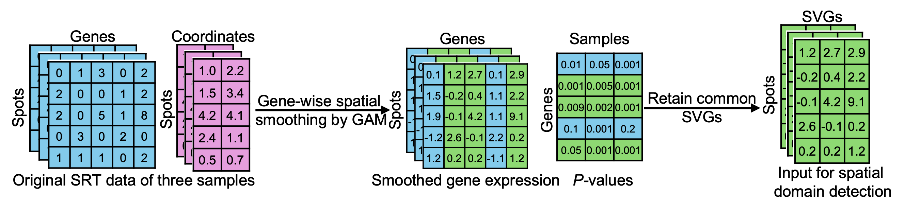
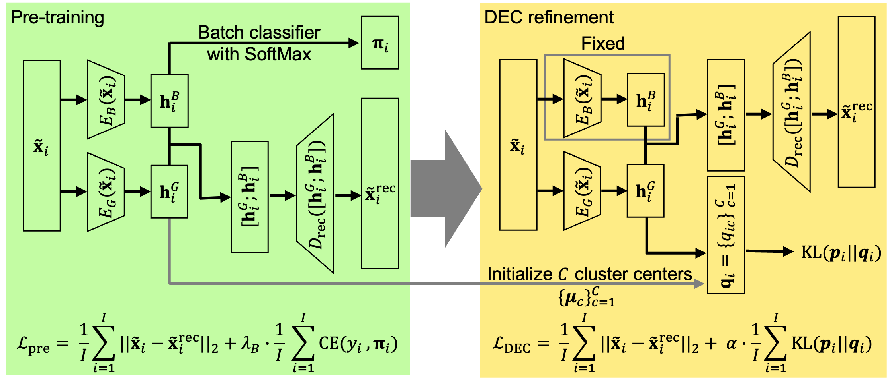

# spMosaic
spMosaic is a Python method for integrating multi-sample spatial transcriptomics data and identifying biologically meaningful spatial domains. It can jointly analyze samples regardless of whether they are collected from the same donor or from different donors.

## Overview
The spMosaic pipeline consists of two stages.

**1. Sample-wise spatial smoothing and common SVG selection**



In the first stage, spMosaic fits a generalized additive model (GAM) to each gene within each sample as a function of spatial coordinates. Spatially variable genes (SVGs) are then identified by comparing the full GAM, which includes spatial coordinates, with a reduced GAM that excludes spatial coordinates, using a chi-square test. A gene is considered an SVG in a sample if its Benjamini–Hochberg adjusted $P$-value is less than or equal to 0.05 in that sample. Genes identified as SVGs in all samples are defined as common SVGs and retained for downstream analysis. The fitted GAM outputs, namely the smoothed gene expression values, are then used as input for the second stage.

**2. Batch-aware dual-encoder DEC framework for spatial domain identification**



In the second stage, spMosaic takes the smoothed gene expression values of the selected common SVGs across all samples as input. The model first performs a pretraining step using a batch-aware dual-encoder autoencoder to separate batch-related variation, represented by $\mathbf{h}_i^{B}$, from biological signal, represented by $\mathbf{h}_i^{G}$, for each spot $i$. Initial cluster centers are then obtained by clustering the biological embedding $\mathbf{h}_i^{G}$. Starting from this initialization, the DEC framework iteratively refines both the biological embedding and the cluster assignments. Finally, spMosaic outputs refined spot-level biological embeddings and refined spatial domain labels.


## Installation

We recommend installing spMosaic in a separate conda environment. The package requires **Python 3.11 or later**.

### Python dependencies

spMosaic relies on the following Python packages:

- `numpy`
- `pandas`
- `scipy`
- `scikit-learn`
- `torch`
- `psutil`
- `anndata`
- `scanpy`
- `matplotlib`
- `seaborn`

These dependencies are installed automatically through the package configuration.

### R dependencies

Some parts of spMosaic also rely on **R**. In particular:

- **Stage 1 gene smoothing** is executed through an R subprocess
- In **stage 2**, DEC cluster initialization may use the R package `mclust`

Therefore, we recommend installing **R in the same conda environment** used for spMosaic.

spMosaic currently requires **R 4.5 or later**. The following R packages are needed:

- `mgcv`
- `Matrix`
- `data.table`
- `dplyr`
- `metapod`
- `mclust`

### Recommended installation

The following commands create a clean conda environment, install the Python package, and set up the required dependencies.

```bash
conda create -n spmosaic-env python=3.11 -y
conda activate spmosaic-env

git clone https://github.com/ShweiSTAT/spMosaic.git
cd spMosaic

pip install -e ".[dev,singlecell,plot]"
```

Then install R and the required R packages into the same environment:
```bash
conda install -c conda-forge r-base r-mgcv r-matrix r-data.table r-dplyr r-mclust
conda install -c bioconda bioconductor-metapod
```
To check that R is installed correctly:
```bash
which Rscript
Rscript -e "library(mgcv); library(Matrix); library(data.table); library(dplyr); library(mclust); library(metapod); cat('R packages installed successfully\n')"
```
The ``which Rscript`` command should point to the Rscript executable inside your spmosaic-env conda environment, if things are correct.

## Tutorial
Please see the `examples` folder for tutorials. They are provided as Jupyter notebooks.

## Issues and communications
If you have any issues using this package, please post them [here](https://github.com/ShweiSTAT/spMosaic/issues). Any suggestions and comments are welcome! For suggestions and comments, please contact Shiwei Fu (shiwei.fu@email.ucr.edu) or Wei Vivian Li (weil@ucr.edu).